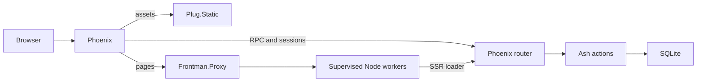

# Architecture

Read when changing routing, SSR, sessions, or data loading.



## One loader, two transports

The index route's loader calls `loadTasks`. That uses the generated AshTypescript client with
`rpcFetch`, a `createIsomorphicFn`:

- During SSR, Node calls Phoenix's actual internal listener, forwarding the visitor's cookies.
- During browser navigation, the browser calls same-origin `/rpc/run` directly.
- Create, update, complete and delete use that same browser transport.

Do not wrap these data functions in `createServerFn`. That would send browser navigation back
through Node. TanStack Router handles loader caching and hydration. The filter belongs in URL
search state, which the loader also uses, so reload and back/forward navigation restore it.

Frontman doesn't enforce this pattern. Full page rendering and any Start server functions or
server routes you add still require Node. Phoenix-hosted assets and direct API calls keep working
when the Node pool is unavailable.

## Sessions and CSRF

Phoenix owns a signed, HTTP-only session cookie and protects RPC POSTs with its CSRF plug.
`GET /auth/csrf` initializes the session and returns a token with `Cache-Control: no-store`.
The browser obtains that token once and sends it with the generated client's requests.

For SSR, the transport requests a token from Phoenix for each RPC call. It passes the visitor's
cookies and merges any new session cookie into the internal RPC request. That handles a first
visit with no cookie without sharing session state between users. Internal `Set-Cookie` responses
are not copied onto the rendered page. The browser initializes its own session on its first API
call. Authentication mutations run in the browser and reach Phoenix directly, so login renewal
and logout cookies go straight to the browser. The transport resets its CSRF cache after each.

`GET /auth/session` loads a user from the signed cookie and a locally stored, unexpired token.
`POST /auth/login` verifies the password through Ash Authentication, renews the session and
stores the token in an HTTP-only cookie. `POST /auth/logout` revokes that token and drops the
cookie. JSON responses only include user ID and email; passwords and JWTs stay out of loader data.

The load-user plug sets Ash's request actor. RPC requires login, and Task policies filter every
read/update/destroy to `user_id == actor.id`. Create relates the actor automatically. Client
input cannot choose an owner. These policies apply to direct Ash calls as well as HTTP requests.
The frontend redirects signed-out users to `/login`; the API enforces access independently.

Tailwind scans only `frontend/src`, explicitly configured in `styles.css`. This keeps the
client and SSR stylesheet hashes consistent in both local and container builds, where generated
output directories otherwise affect automatic source detection.

Demo credentials are returned only when `:demo_seed?` is enabled, which is the default in
development and test. Production requires explicit `SEED_DEMO=true`. SQLite runs with WAL and
foreign keys enabled through the adapter. Keep the file on a writable local disk or volume.

## Cached pages

`/about` is the same for every visitor, so Frontman renders it once per server and serves it from
memory. Its route opts in with `staticData`:

```tsx
export const Route = createFileRoute("/about")({
  staticData: { pageCache: "public, max-age=300, stale-while-revalidate=86400" },
  component: About,
});
```

The root route reads `pageCache` from the deepest matched route that sets it, and sends it as
Frontman's `x-frontman-cache` header in production builds. The page is fresh for five minutes,
then served stale for up to a day while Frontman refreshes it in the background. See Frontman's
[page cache guide](https://github.com/wtsnz/frontman#page-cache) for the directives and the
rules about what is never stored.

A cached page is served to everyone, so its server render must not depend on who asked. The
root loader normally loads the session, and the header shows the signed-in email. On a cached
page the root loader returns an empty session during SSR instead, and the browser loads the
real one after hydration, so the email appears a moment later. Any loader you add to a cached
route has to follow the same rule. Without it, the first visitor to render the page would
decide whose email everyone else sees.

`Set-Cookie` responses and non-200 pages are never cached, and Frontman keys entries on the host,
path and query string, ignoring the `utm_*`, `gclid` and `fbclid` parameters configured in
`config/runtime.exs`. Each server keeps its own copy, and a deploy starts empty. Set
`FRONTEND_CACHE=false` to turn the cache off. Vite dev mode never caches.

## Runtime ownership

`FrontendPool` starts after the Phoenix endpoint, obtains its bound port, and passes `BACKEND_URL`
and `PUBLIC_ORIGIN` to Frontman's workers. `BACKEND_URL` is private; `PUBLIC_ORIGIN` is trusted
configuration used for redirects and absolute URLs. Client-provided forwarded headers cannot
choose the public origin in the server entry.

The endpoint serves built assets before `Frontman.Proxy` and places the proxy before body parsers.
RPC, sessions and health paths bypass the proxy. The Node readiness handshake is private.
The health controller counts only Frontman workers in `:ready` state, and checks the database.

Frontman's pool has two workers and 16 slots per worker by default. Measure your workload before
raising either. Frontman supplies health checks, backoff and drain, and packages Node and the
frontend build into the release; the application supplies routes, deployment and domain.
